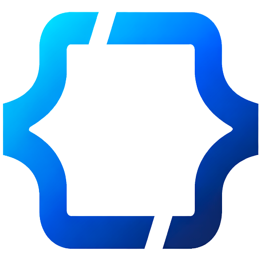

<p align="center">
  
</p>

<h1 align="center">DevPortfolio CMS</h1>

<p align="center">
    <strong>Sistema de Gestión de Contenidos para Portafolios Profesionales</strong><br>
    Proyecto de Fin de Grado (TFG) - Desarrollo de Aplicaciones Web
</p>

<p align="center">
    <a href="https://laravel.com"></a>
    <a href="https://tailwindcss.com"></a>
    <a href="https://alpinejs.dev"></a>
    <a href="https://www.mysql.com"></a>
</p>

---

## 📋 Descripción

**DevPortfolio** es una aplicación web Full Stack diseñada para gestionar y visualizar un portafolio profesional de desarrollo. A diferencia de las webs estáticas, esta solución implementa un **Panel de Administración (Backoffice)** completo que permite gestionar proyectos, clientes y comunicaciones en tiempo real.

El sistema incluye un **CRM integrado** para vincular mensajes recibidos desde la web pública con clientes y contactos empresariales, facilitando la gestión de oportunidades laborales.

## ✨ Funcionalidades Principales

### 🌍 Área Pública (Frontend)
*   **Landing Page Dinámica:** Presentación profesional con secciones de "Sobre mí", "Stack Tecnológico" y "Proyectos Destacados".
*   **Modo Oscuro/Claro:** Sistema de temas persistente con detección automática y toggle manual animado.
*   **Catálogo de Proyectos:** Vista paginada con tarjetas interactivas (Efecto Spotlight) y detalles técnicos.
*   **Formulario de Contacto:** Envío de mensajes con validación en tiempo real y feedback visual.

### 🔒 Área Privada (Backend & CRM)
*   **Dashboard:** Métricas en tiempo real (Proyectos, Mensajes pendientes, Clientes).
*   **Gestión de Proyectos (CRUD):**
    *   Subida y previsualización de imágenes (Drag & Drop simulado).
    *   Asignación de tecnologías y clientes (Relación N:M).
    *   Filtros por estado (Público/Borrador) y cliente.
*   **Gestión de Clientes (CRM):**
    *   Ficha de empresa/particular.
    *   **Agenda de Contactos:** Gestión de empleados dentro de una empresa con cargos, teléfonos y notas.
    *   **Historial de Mensajes:** Visualización de todas las comunicaciones vinculadas a un cliente.
*   **Bandeja de Entrada Inteligente:**
    *   Recepción de mensajes anónimos desde la web.
    *   **Sistema de Asignación:** Conversión de "Lead" (mensaje anónimo) a "Contacto" vinculado a un Cliente existente.
    *   Ordenación y filtrado por estado (Leído/No leído).

## 🛠️ Stack Tecnológico

*   **Backend:** PHP 8.2, Laravel Framework (MVC Architecture).
*   **Frontend:** Blade Templates, Tailwind CSS, Alpine.js (para interactividad ligera sin SPA).
*   **Base de Datos:** MySQL 8.0.
*   **Entorno de Desarrollo:** Docker (Laravel Sail) sobre WSL2.
*   **Control de Versiones:** Git & GitHub.

## 🚀 Instalación y Despliegue (Local)

Este proyecto utiliza **Laravel Sail** (Docker), por lo que no necesitas instalar PHP ni MySQL en tu máquina local, solo Docker Desktop.

1.  **Clonar el repositorio:**
    ```bash
    git clone https://github.com/CarloskHard/portfolio-cms.git
    cd portfolio-cms
    ```

2.  **Instalar dependencias:**
    ```bash
    docker run --rm \
        -u "$(id -u):$(id -g)" \
        -v "$(pwd):/var/www/html" \
        -w /var/www/html \
        laravelsail/php82-composer:latest \
        composer install --ignore-platform-reqs
    ```

3.  **Configurar entorno:**
    ```bash
    cp .env.example .env
    # Editar .env si es necesario, la configuración por defecto de Sail funciona automáticamente.
    ```

4.  **Levantar contenedores:**
    ```bash
    ./vendor/bin/sail up -d
    ```

5.  **Generar clave y Base de Datos:**
    ```bash
    ./vendor/bin/sail artisan key:generate
    ./vendor/bin/sail artisan migrate:fresh --seed
    ```

6.  **Compilar Assets (Frontend):**
    ```bash
    ./vendor/bin/sail npm install
    ./vendor/bin/sail npm run dev
    ```

## 🔑 Credenciales de Acceso (Demo)

El *seeder* genera un usuario administrador por defecto para pruebas:

*   **URL:** `http://localhost/login`
*   **Email:** `admin@admin.com`
*   **Contraseña:** `password`

---